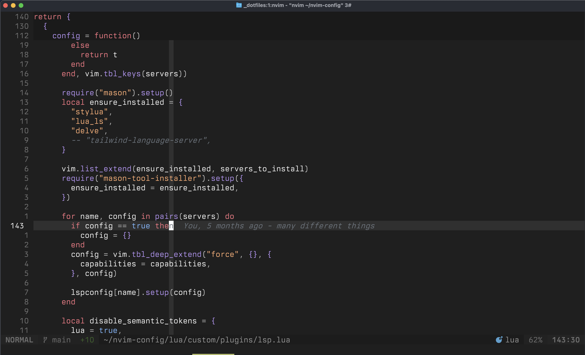

# min-dark.nvim

A minimal, dark color scheme for Neovim with subtle syntax highlighting and a clean interface.



## Features

- Dark, low-contrast theme with a focus on readability
- Support for popular plugins:
  - Treesitter
  - LSP diagnostics
  - nvim-cmp
  - Telescope
  - NvimTree
  - Bufferline
  - Lualine
  - and more...

## Installation

### Using [packer.nvim](https://github.com/wbthomason/packer.nvim)

```lua
use 'wesleimp/min-theme.nvim'
```

### Using [lazy.nvim](https://github.com/folke/lazy.nvim)

```lua
{
  'wesleimp/min-theme.nvim',
  lazy = false,
  priority = 1000, -- load this before other plugins
}
```

### Using [vim-plug](https://github.com/junegunn/vim-plug)

```vim
Plug 'wesleimp/min-theme.nvim'
```

## Usage

```vim
" Vim Script
colorscheme min-dark
```

```lua
-- Lua
vim.cmd.colorscheme 'min-dark'
```

## Configuration

This colorscheme has no configuration options currently. It aims to provide a clean, consistent experience out of the box.

## Credits

This theme was inspired by the [min-dark for VSCode](https://github.com/miguelsolorio/min-theme)

## License

MIT
